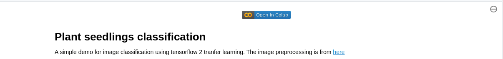
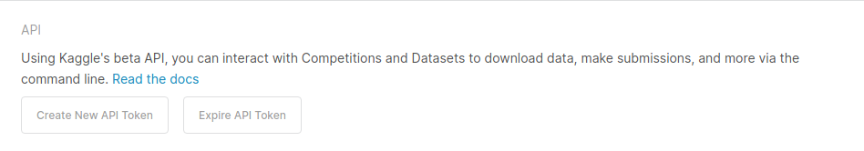
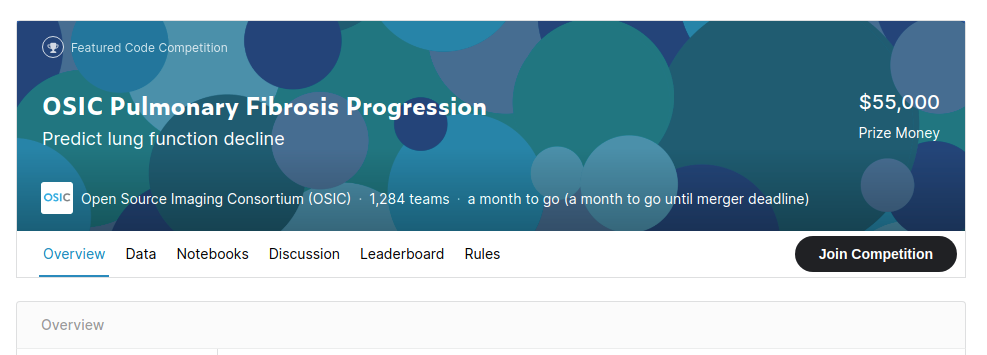
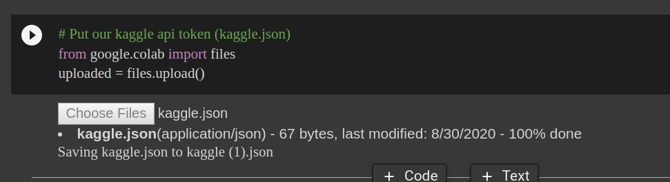

# Kaggles
This repository use `colab` to create some simple jupyter notebook to do the basic prediction for kaggle.
If you want to check or edit the jupyter notebook, I recommand you to click the button of `Open in colab`.

So that you can edit and run the jupyter notebook and even save to your own colab.

## Summary
### House-price
- Data: [House Prices: Advanced Regression Techniques](https://www.kaggle.com/c/house-prices-advanced-regression-techniques)
- Problem: Regression
- Tools: 
  - pycaret

### Titanic
- Data: [Titanic: Machine Learning from Disaster](https://www.kaggle.com/c/titanic)
- Problem: Binary classification
- Tools:
  - Scikit-learn
  - Xgboost

### Plant-seedlings-classification
- Data: [Plant Seedlings Classification](https://www.kaggle.com/c/plant-seedlings-classification)
- Problem: Image classification
- Tools:
  - TensorFlow
  - Transfer Learning
  
## Kaggle API Setup
Kaggle API is able to let us download the kaggle competition data and upload the competition.

### 1. Create API Token

Go to your kaggle account and click `Create New API Token` then you will get a `kaggle.json` file.

### 2. I agree on the competition

Join the competition that you want to play with  before you use the API.

### 3. Upload the kaggle.json on the colab cell

Upload your `kaggle.json` to the colab environment
